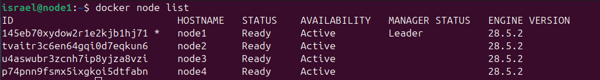
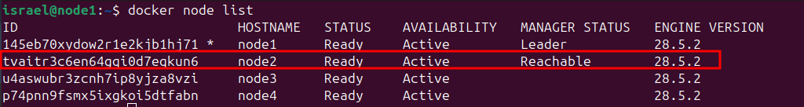

# portainer-traefik-letsencrypt
Portainer com traefik e LetsEncrypt

### 1. Instale o Docker na sua distribuição. Para esse tutorial iremos usar o Ubuntu 24.04

> Siga os passo do site oficialdo Docker para a instalação: 
  https://docs.docker.com/engine/install/ubuntu/   

>OBS: NO MOMENTO QUE CRIEI O TUTORIAL A VERSÃO DO DOCKER QUE FUNCIONOU COM O SWARM E TRAEFIK FOI:   
**5:28.5.2-1~ubuntu.24.04~noble**   

### 1.2. Subindo o cluster Swarm   
- Execute o comando abaixo para iniciar o cluster Swarm
```
docker swarm init --advertise-addr=<ip do nó principal>
```   

> ## Após executar o comando acima irá retornar uma linha de comando parecido com o exemplo abaixo para ser executado nos outros nós para integra-los ao cluster   
> **ex:** docker swarm join --token SWMTKN-1-20hm415u9nn2lllcgh2r2gsud4nwfj0v9kqmbwsrkh4now90ip-51kvxenylrwef3y6tsf8m411o 172.25.44.17:2377   


### 1.3. Liste os nós do Cluster
```
docker node list
```   

> Retornará algo como a imagem abaixo:   

   


### 1.4. Promova um dos nós como secundário do Master
```
docker node promote node2
```   

> Retornará algo como a imagem abaixo:   
>    
   

## Agora vamos subir o Portainer 

### 2. Criando uma rede pública no Docker com Swarm
```
docker network create -d overlay --attachable traefik_public
```   

### 2.1. Em seguida, use o manifesto yml para realizar o deploy da stack do Portainer
```
docker stack deploy -c portainer-agent-stack.yml portainer
```   

### 2.2. Acesse o Portainer de inicio pelo ip do node na porta 9443
```
http://<ip do node>:9443
```   

## Agora vamos subir o Traefik   

### 3.0. Primeiro vamos criar o usuário e senha do Traefik com o comando abaixo Alterando o **seuusuario** e **sua_senha** por seus dados. Guarde o resultado pois iremos usa-lo abaixo.
```
echo $(htpasswd -nb seuusuario sua_senha) | sed -e s/\\$/\\$\\$/g
```

### 3.1. Siga os passo abaixo

- No Portainer vá em **Stack** e clique bo botão **+ Add stack**  
- Em Create stack, adicione o nome da sua stack ex: **traefik_v3**
- Selecione **Web editor**
- Copie e cole o manifesto **traefik.yml**
- Com o manifesto colado altere o **certificatesresolvers.le.acme.email=<SEU-EMAIL@SEU-DOMINIO>** para seu e-mail
- Procure por **traefik.http.routers.traefik.rule=Host(`${DOMINIO_TRAEFIK}`)** e altere para o seu dominio. ex. **traefik.seudominio.com.br**
- Agora procure por **traefik.http.middlewares.traefik-auth.basicauth.users=<COLOQUE_SEU_USUARIO>:<COLOQUE_SUA_SENHA_HASHED>** e altere pelo usuário e senha criado anteriormente.
- Desmarque **Enable access control**
- E por final clique no botão **Deploy the stack**


### 3.2. Vamos adicionar uma rota no manifesto do Portainer para ser acessado via Traefik.

- Volte ao terminal e edite o manifesto do portainer **portainer-agent-stack.yml**
- Descomente os **labels**
```
#      labels:
#        - traefik.enable=true
#        - traefik.http.routers.portainer.rule=Host(`portainer.israel.com.br`)
#        - traefik.http.routers.portainer.entrypoints=websecure
#        - traefik.http.routers.portainer.tls.certresolver=le
#        - traefik.http.routers.portainer.service=portainer
#        - traefik.http.services.portainer.loadbalancer.server.port=9000
```   

- Após descomentar, execute o comando para realizar o update da stack
```
docker stack deploy -c portainer-agent-stack.yml portainer
```    

### 3.3. Agora acesse o Portainer por sua url
```
https://portainer.seu-dominio.com.br
```
